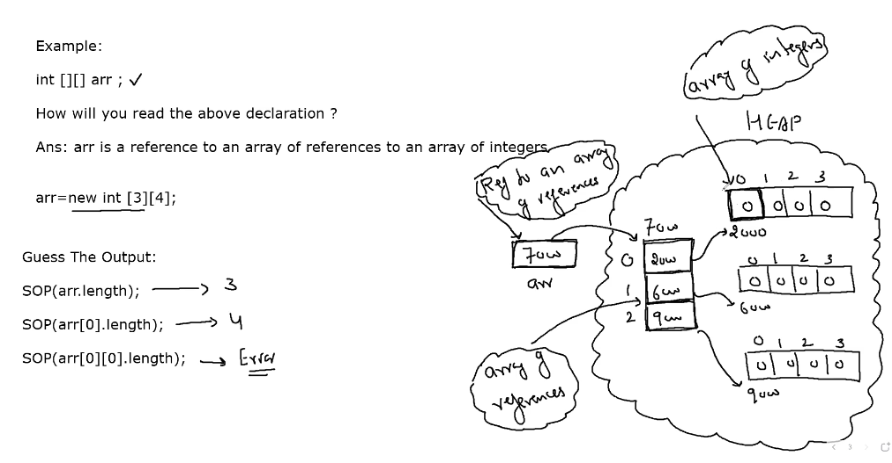

 # Array

Array is a collection of simlar data types in a continuos memory locations

- In Java Arrays are considered as objects

- Since Arrays are treateda s objects by java so they also are created dynamically

- to create an array we use the keyword new , just like we use to create an object

- since they are dynamically created , so they live on heap area of memory

- because they are dynamic they don't have any name so we require a reference to refer to an array and this reference is called array reference

### Syntax of creating array 
___

Since arrays are objects, we have to create them 2 steps:
1. Creating Array Reference

```java
<data type>[ ] <array_ref_name>;  // This is recommended 

int [] arr // "arr" is a reference to an array of integers


or 


<data type> array_ref_name [ ]; // Although it works but not recommended

```


2. Creating The Actual Array 
```java
<array_ref_name> = new <data type>[ size ]
arr = new int[10]
```
___
```java
 
 int [] arr = new int[10]

```

___

Accessing an array 

```java

<array_ref_name>[index_no] = value;
<var_name>  = <array_ref_name>[index_no]

____

int [] arr new int[10]

arr[0] = 25;
arr[1] = 30;
System.out.println(arr[0]);

```

## How Java handles  DeAllocation of dynamic blocks

*  <u>Garbage block</u>

    In java if a dynamic block is not being referred by an reference then such dynamic blocks are called as garbage block

* <u>Garbage collector</u>

    The garbage collector is a program which runs on the Java Virtual Machine which gets rid of objects which are not being used by a Java application anymore. It is a form of automatic memory management.

    <i>ye program heap area me chalta hai aur jo programs use nhi horhe wo hta deta hai , ye kabhi stack me nhi chlta</i>

___

# Double Dimensional arrays

There are two types of 2D arrays :-


### 1. Reactangle 2D Array
Every row contains same number of columns

* Syntax for creating rectangular 2D arrays
    ```java

    1. Declaring array reference:

        <data_type> [][] <array_ref>;

        or

        <data_type> <array_ref> [][] ;

    2. Creating the Actual array:

        <array_name> = new <data type>[row size][col size];
        
    ```

    
    ```java
    int [][] arr = new int [3][4]
    ```

### 2. Jagged 2D Array
Every row can have different number of columns
* Syntax for creating jagged 2D arrays

    ```java

    1. creating array reference:

        <data_type> [][] <array_ref> = new <data type>[row size][];

        

    2. Creating the Actual array:

        <array_ref_name>[row_index] = new <data type>[col size]
        <array_ref_name>[row_index] = new <data type>[col size]
        .
        .
        .
        .
        
    ```
    ```java
    Example :-

    int [][] arr = new int [3][];

    arr[0] = new int [4];
    arr[1] = new int [3];
    arr[2] = new int [2;
    arr[3] = new int [5];
    ```
