# Java and Computer basics

### Intro to 32 bit and 64 bit Operating System

> In computing, a byte is the unit of data, and processing is generally denoted as bit processing.

> Generally, there exist two types of processors, namely a 32-bit processor and a 64-bit processor.

- >A 32-bit system can access 2<sup>32</sup> memory addresses, i.e., 4 GB of RAM or physical memory; ideally, it can also access more than 4 GB of RAM.

- > A 64-bit system can access 2<sup>64</sup> memory addresses, i.e., actually 18-Quintillion bytes of RAM. In short, any amount of memory greater than 4 GB can be easily handled by it.


## Features of Java

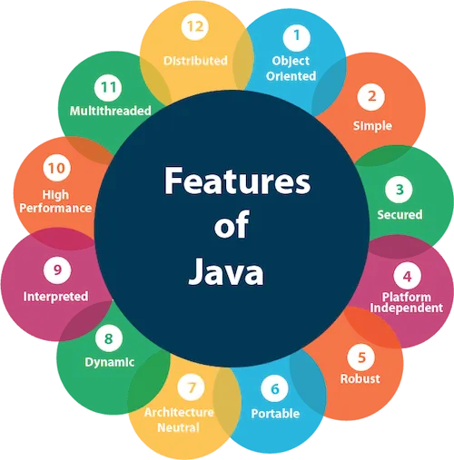

* <u>Object Oriented</u>: In object oriented programming everything is an object rather that function and logic.

* <u>Simple</u>: Java is simple to understand, easy to learn and implement.

* <u>Secured</u>: It is possible to design secured software systems using Java.

* <u>Platform Independent</u>: Java is write once and run anywhere language, meaning once the code is written, it can be executed on any software and hardware systems.

* <u>Portable</u>: Java is not necessarily fixated to a single hardware machine. Once created, java code can be used on any platform.

* <u>Architecture Neutral</u>: Java is architecture neutral meaning the size of primitive type is fixed and does not vary depending upon the type of architecture.

* <u>Robust</u>: Java emphasizes a lot on error handling, type checking, memory management, etc. This makes it a robust language.

* <u>Interpreted</u>: Java converts high-level program statement into Assembly Level Language, thus making it interpreted.

* <u>Distributed</u>: Java lets us create distributed applications that can run on multiple computers simultaneously.

* <u>Dynamic</u>: Java is designed to adapt to ever evolving systems thus making it dynamic.

* <u>Multi-thread</u>: multi-threading is an important feature provided by java for creating web applications.

* <u>High-performance</u>: Java uses Just-In-Time compiler thus giving us a high performance.

____
___

- >  Unlike most programming languages that generates executable code upon compilation; the 
JVM generates byte codes as a result of compilation.<br>
Java byte codes are form of instructions 
understood by Java Virtual Machine and usually generated as a result of compiling Java 
languages source code

  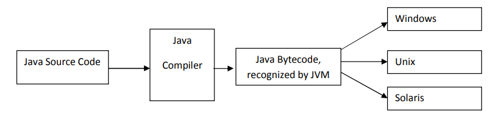

- >Bytecode is a highly optimized set of instructions designed to be executed by the Java run-time system, which is called the JVM


___
# JVM  vs JRE vs JDK
 - In hierarchial order <br>
   * JVM -> JRE -> JDK
   
- > JVM ( Java Virtual Machine )<br>
   1. The JVM is a virtual computer that executes Java bytecode
   2. It is the code execution component of java
   * Important components of java are <br>
    -> Interpreter <br>
    -> Garbage Collector
- > JRE ( Java Run Environment )<br>
   1. The JRE is a package that includes the JVM and necessary libraries to run Java applications. 
   
- > JDK ( Java Development Kit )<br>
   1. Contains the JRE and development tools for writing, compiling, and debugging Java applications. 
   
 ____
   ## First Java Program

```java
public class Abc {
    public static void main(String[] args) {
        System.out.println("Hello, World!");
    }
}

```


1. **`public`**:
   - `public` is an access modifier in Java. It indicates that the class or method can be accessed from any other class or package. In this case, `public` is used to declare the class `HelloWorld`, which means it can be accessed from any other class.

2. **`class`**:
   - `class` is a keyword in Java used to define a class. A class is a blueprint for creating objects.<br> It encapsulates data (fields) and behavior (methods) related to a particular concept or entity.

3. **`Abc`**:
   - This is the name of the class.<br> In Java, class names are case-sensitive and should match the name of the file in which the class is defined (including capitalization).<br> In this case, the class is named `Abc`, so it should be saved in a file named `Abc.java`.

4. **`{}`**:
   - Curly braces are used to define blocks of code. In this program, they are used to define the body of the `HelloWorld` class and the `main` method.

5. 
      - `public`: Access modifier indicating that the method is accessible from any class.
      - `static`: In Java, you can use the static keyword to declare that a certain variable or method is shared by all instances of the class
      - `void`: Specifies that the method does not return any value.
      - `main`: The name of the method.
      - `(String[] args)`: The method takes an array of strings as input. This parameter allows you to pass arguments to the program when it is executed from the command line.

7. **`main(String[] args)`** (continued):
   - The `main` method is the entry point of the program. It's where the program starts executing. It is called when the program is run, and it takes an array of strings (`args`) as input. These are the arguments that can be passed to the program when it is executed from the command line.

8. **`args`**:
   - `args` is a parameter of the `main` method. It is an array of strings that allows you to pass arguments to the program when it is executed. For example, if you run the program from the command line like this: `java HelloWorld arg1 arg2`, `args` will be an array containing `["arg1", "arg2"]`.


- > In Java we usually call <i>`functions`</i> as  <i>`methods`</i> 

- > * <u>Method</u> -> Associated with an object or class in object-oriented programming.<br>
<u>Function</u> -> Standalone block of code.
___

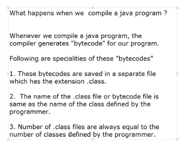
====================================
___
   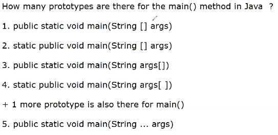

## Data Types in Java
______

   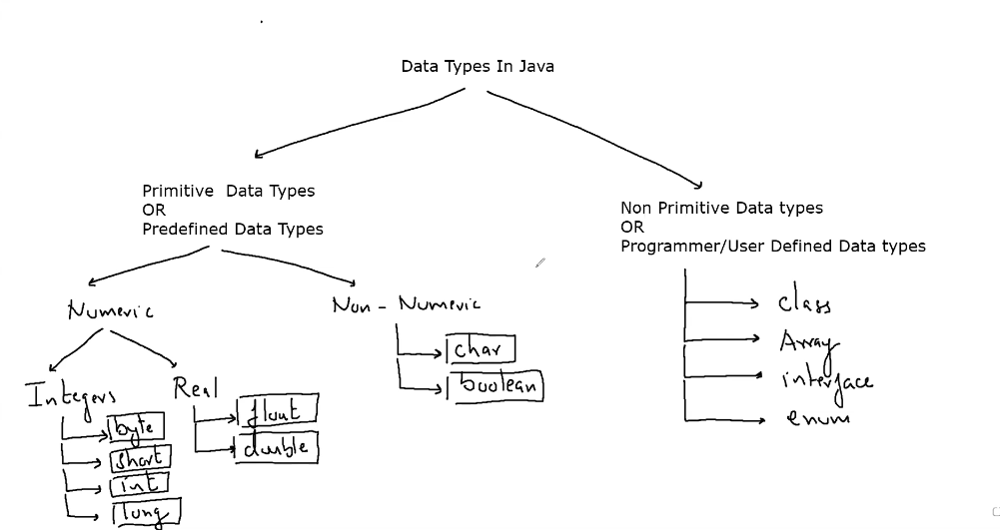
   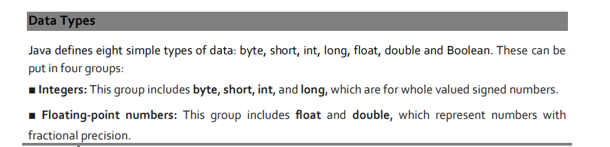
   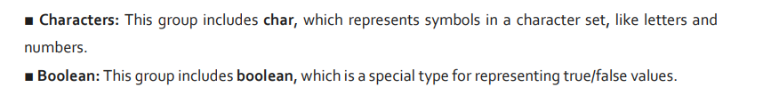 
   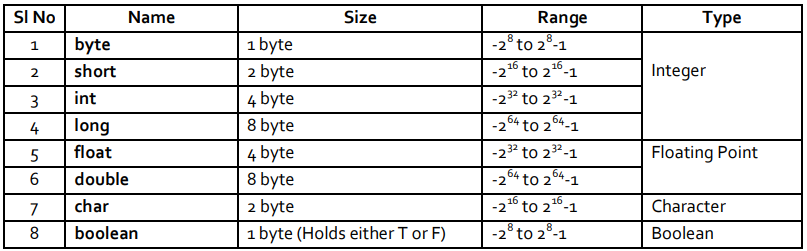
____
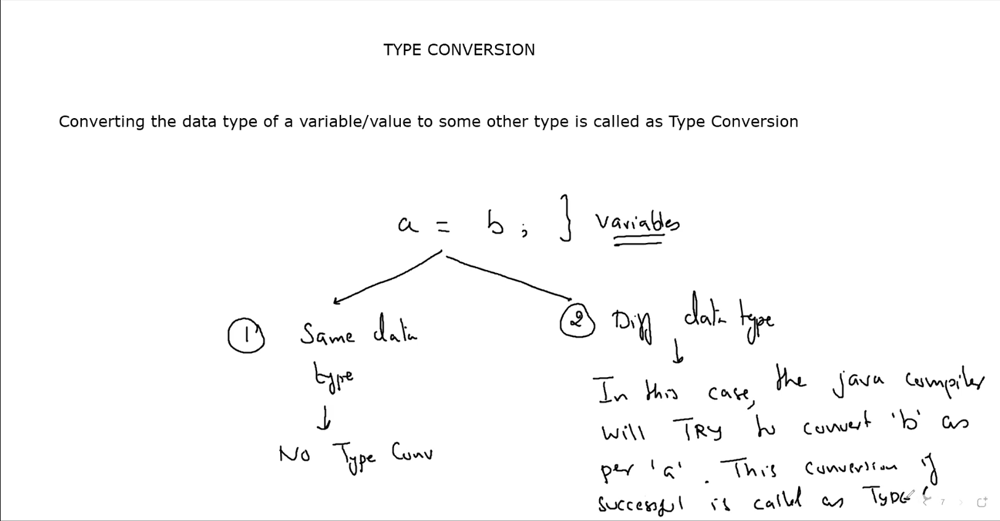
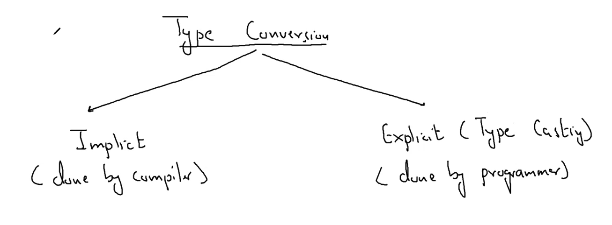
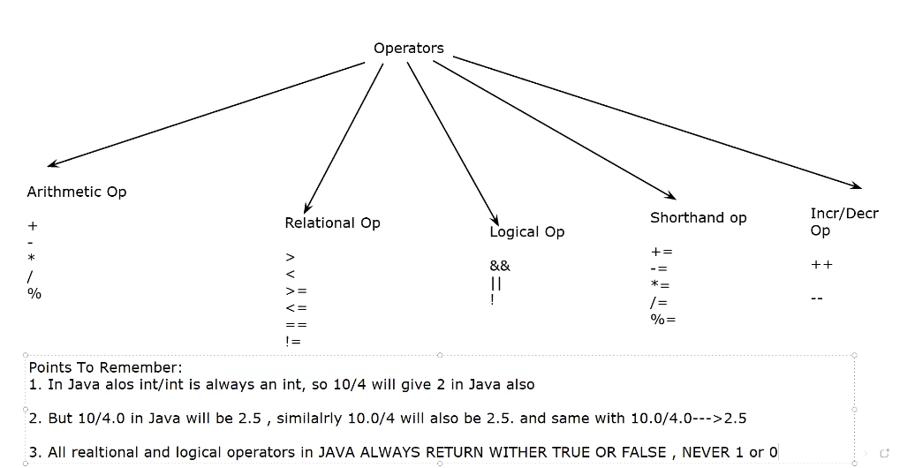

### Implicit type conversion

Implicit type conversion in Java happens when the Java compiler automatically converts one data type to another without any explicit instructions from the programmer.
```java

int numInt = 10; // This is an integer variable
double numDouble; // This is a double variable

numDouble = numInt; // Implicit type conversion: int to double

System.out.println("Integer value: " + numInt);
System.out.println("Double value after implicit conversion: " + numDouble);


```
### Explicit type conversion

Explicit type conversion, also known as type casting, in Java involves converting a variable of one data type to another by the programmer's explicit instruction
```java

double numDouble = 10.5; // This is a double variable
int numInt; // This is an integer variable

numInt = (int) numDouble; // Explicit type conversion: double to int

System.out.println("Double value: " + numDouble);
System.out.println("Integer value after explicit conversion: " + numInt);

```
___

## Operators in Java


___

- > How many types of variables are there ?<br>
   In Java there are 3 types of variables:
   1. <u>Local variables</u> : Declared inside method body

   2. <u>Instance variables</u> : Declared inside class body
   3. <u>static variables</u> : Declared inside class body prefixed with the keyword static

___
### Wrapper Classes [Refer here](./01_Basics/TakeInput.java)

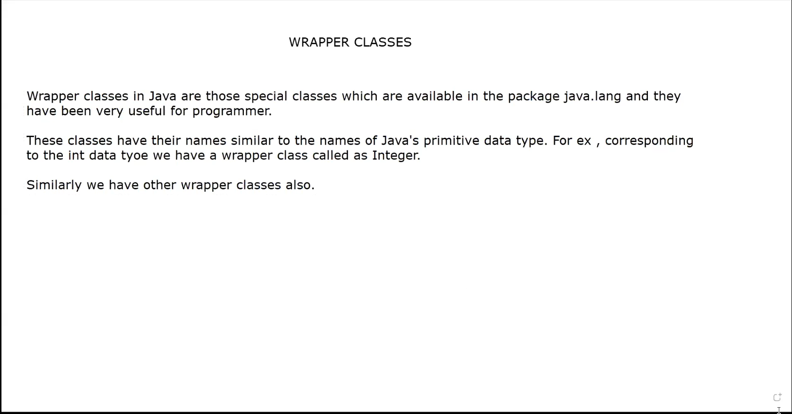
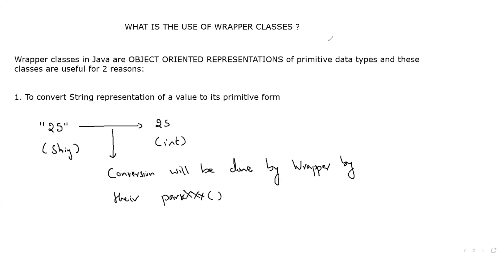
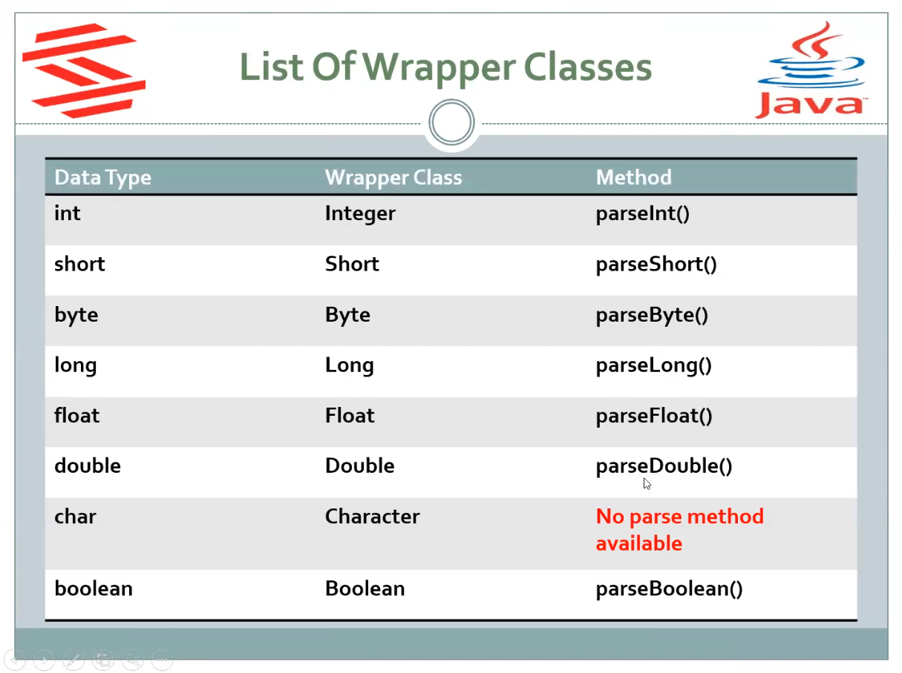
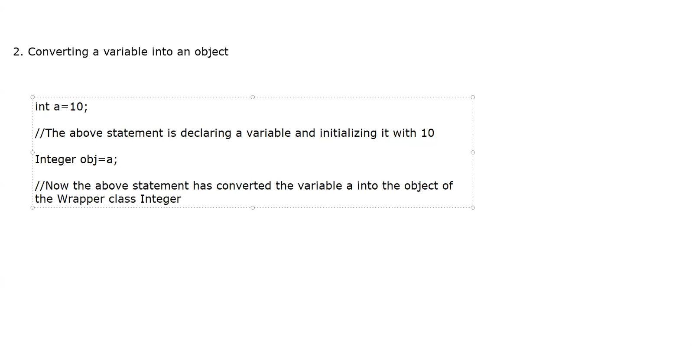

## Using String Class Methods 

In Java string is a very userful predefined class and it contains a huge set of predefined methods which allow us to perform various operations on strings.

But the maximum of these methods in java are non-static . This means for calling them we must learn how to create objects of string class

```java
// creating object 

class Student 
{
   int roll;
   char grade;
   double per;
   // some methods 
   get();
   show();
}

Student S = new Student();
S.get();
S.show();

```
### Using String Class 

```java
class Test 
{
   public static void main(String [] args)
   {
      String s1 = new String("abhinav");
      String s2 = new String("tirole");
      System.out.println(s1); // abhinav
      System.out.println(s2); // tirole
      
      
      System.out.println(s1 == s2); 
      // this will give false  
   }
}
```
- > whenever we display string object references <br>Java will never show the adresses stored in these references <br>Rather Java will always print the contents of the STRING OBJECTS to which the reference is pointing  
- > however when we compare two references then , Java doesn't compare the contents of the object pointed by these references rather java compares the adresses stored in these references

   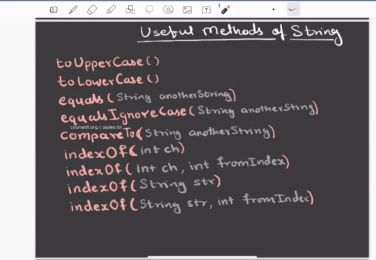

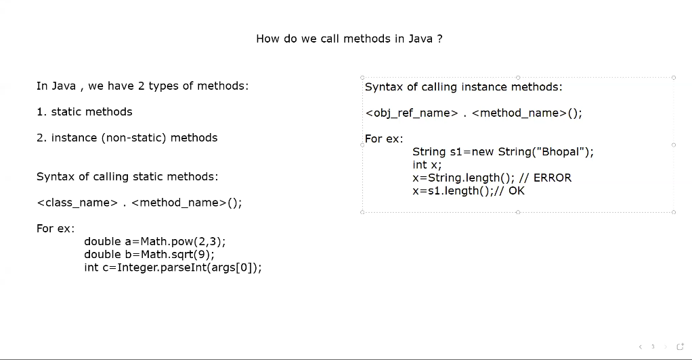

### decision control statements

- >   #### If 
      - single if

            if(test cond)
            {
               ....
               ....
            } 

      - if else

            if(test cond)
              {
               ....
              }
            else
              {
               ....
              }

      - if..else if.. else

            if(test cond)
              {
               ....
              }
            else if(test cond)
              {
               ....
              }   
            else
              {
               ....
              }

      - nested if

            if(test cond)
              {
                  if(test cond)
                     {
                         ....
                     }
                  else
                     {
                        ....
                     }
               }
            else if(test cond)
              {
               ....
              }   
            else
              {
               ....
              }

- >   #### Switch
      
      - switch (var_name)
      {
         case <value1>:
            .....
            .....
         break;
         case <value2>:
            .....
            .....
         break;
         default:
            .....
            .....
         break;   
      }

- >   #### Ternary operator
       The ternary operator can be used as an alternative to the Java's 
       if-else and switch statements.

       var_name = (test condition) ?(true_exprssiom):(false_expression)

### Scanner class

* Important methods of Scanner Class <br>

    ```java
         public int nextInt() => accepts an integer as input 

         public double nextDouble() => accepts an double value as input 

         public float nextFloat() => accepts an float value as input 

         public boolean nextBoolean() => accepts an boolean value as input    
       .
       .
       .
       .
      Like this we have nextXXX() methods for every primitive data type except character


      for accepting Strings we have 2 methods in Scanner class:
      1. public String next()
      2. public Stting nextLine()


____

###   Arguments passing in java

In java , arguments are passed by value . 
not passed by reference

In java , we can pass 2 kinds of arguments to methods :<br>
#### 1. <u> Passing variables</u>
 * 1. whenever we pass a variable as a argument to a method , java always passes it value
 * 2. this value is then received by another variable declared in the formal arg list of the method being called
 * 3. so, now , both the arguments , actual and formal , have the same value 
 * 4. but their adressess are different 
 * 5. so if we make any change in the value of formal argument , then it will never change the value of actual argument 
 * 6. so . the conclusion is that , variables in java are always passed using pass by value mechanism  


#### 2. <u> Passing reference as argument to method </u>( array reference , object reference )


 * 1. whenever we pass any reference as argument to a method , then java passes the adress of the object pointed by that reference
 * 2. this address is then received by the formal reference declared inside the method's argument list
 * 3. so now both the actual reference and the formal reference start pointing to the same object 
 * 4. thus if we make any changes in the formal reference itself then it will never effect the actual reference nor it will effect the original objects data
 * 5. but if we make some changes in the formal reference itself then it will never effect the actual referennce nor it will effect the original object
 * 6. thus we say that even reference in java are passed using pass by value 
 * 7. so the final conclusion is that<U> NOTHING IN JAVA IS PASSED USING PASS BY REFERENCE</U > 


